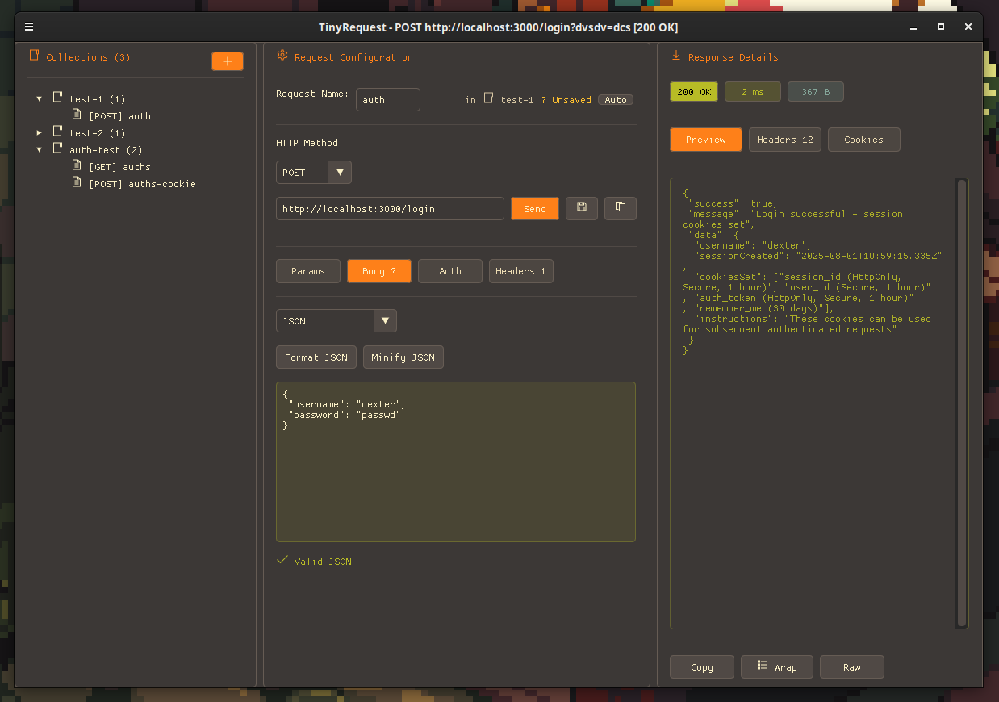

<div align="center">
  
  
  # TinyRequest
  
  **A lightweight, fast, and intuitive HTTP client for Linux**
  
  [](https://opensource.org/licenses/MIT)
  [](https://en.wikipedia.org/wiki/C11_(C_standard_revision))
  [](https://isocpp.org/)
  [](https://www.linux.org/)
  [](https://cmake.org/)
  [](https://github.com/ocornut/imgui)
  [](https://curl.se/libcurl/)
  [](https://github.com/DaveGamble/cJSON)
  [](https://www.glfw.org/)
  [](https://www.opengl.org/)
  
  
</div>

## ✨ Features

- 🚀 **Lightning Fast** - Native C/C++ performance with minimal resource usage
- 🎯 **Intuitive Interface** - Clean, modern UI built with  ImGui
- 📁 **Request Collections** - Organize your API requests like a pro
- 🍪 **Smart Cookie Management** - Automatic cookie handling per collection
- 🔐 **Multiple Auth Types** - API Key, Bearer Token, Basic Auth, OAuth 2.0
- 🛡️ **SSL Support** - Configurable SSL verification for secure requests
- ⚡ **Real-time Response** - See response times, status codes, and headers instantly

## 🖥️ System Requirements

- **OS**: Linux (Ubuntu, Fedora, Arch, openSUSE)
- **Architecture**: x86_64
- **Dependencies**: GLFW3, libcurl, OpenGL
- **Memory**: ~50MB RAM usage
- **Disk**: ~10MB installation size

## 🚀 Quick Start

### Install from Release (Recommended)

**For Debian/Ubuntu users:**

1. **Download the latest .deb package** from the [Releases page](https://github.com/dexter-xD/TinyRequest/releases)
   ```bash
   # Download the latest release (replace with actual version)
   wget https://github.com/dexter-xD/TinyRequest/releases/download/v1.0.4/tinyrequest-v1.0.4.deb
   ```

2. **Install the package**
   ```bash
   sudo dpkg -i tinyrequest-v1.0.deb
   ```

3. **Fix dependencies if needed**
   ```bash
   sudo apt-get install -f
   ```

4. **Launch TinyRequest**
   ```bash
   tinyrequest
   ```
   Or find it in your applications menu under "Development" or "Internet"

**Alternative download methods:**
- Visit the [Releases page](https://github.com/dexter-xD/TinyRequest/releases) directly
- Use `curl`: `curl -LO https://github.com/dexter-xD/TinyRequest/releases/download/v1.0/tinyrequest-v1.0.deb`

## 🔧 Manual Build

### 1. Install Dependencies

**Option A: Use the automated script (Recommended)**
```bash
./scripts/fetch_dependencies.sh
```
This script will automatically detect your Linux distribution and install all required system dependencies, plus fetch the external libraries.

**Option B: Manual installation**

**Ubuntu/Debian:**
```bash
sudo apt update && sudo apt install -y libglfw3-dev libcurl4-openssl-dev libcjson-dev cmake build-essential
```

**Fedora:**
```bash
sudo dnf install -y glfw-devel libcurl-devel cjson-devel cmake gcc gcc-c++ mesa-libGL-devel
```

**Arch Linux:**
```bash
sudo pacman -S glfw curl cjson cmake gcc mesa libx11 libxrandr libxinerama libxcursor libxi
```

If you chose Option B, you'll also need to fetch external dependencies:
```bash
./scripts/fetch_dependencies.sh
```

### 2. Build
```bash
# Debug build
cmake -S . -B cmake-build-debug -DCMAKE_BUILD_TYPE=Debug
cmake --build cmake-build-debug

# Release build
cmake -S . -B cmake-build-release -DCMAKE_BUILD_TYPE=Release
cmake --build cmake-build-release
```

## 📖 Usage

### Creating Your First Request

1. **Launch TinyRequest** - The app opens with a clean three-tab interface
2. **Collections Tab** - Create a new collection to organize your requests
3. **Request Tab** - Configure your HTTP request:
   - Choose method (GET, POST, PUT, DELETE, etc.)
   - Enter URL
   - Add headers and authentication
   - Set request body for POST/PUT requests
4. **Send Request** - Click send and view results in the Response tab

### Authentication Support

TinyRequest supports multiple authentication methods:

- **API Key** - Header or query parameter
- **Bearer Token** - Authorization header
- **Basic Auth** - Username/password
- **OAuth 2.0** - Access token

Each auth type can be enabled/disabled independently per request.

### Collections & Cookie Management

- **Collections** organize related requests (like Postman workspaces)
- **Automatic cookie handling** - Cookies are stored per collection
- **Session persistence** - Maintain login state across requests
- **Import/Export** - Share collections with team members


### Contributing

I welcome contributions from the community! Whether you're fixing bugs, adding features, or improving documentation, your help is appreciated.

**Quick Start:**
1. Fork the repository
2. Create a feature branch (`git checkout -b feature/amazing-feature`)
3. Commit your changes (`git commit -m 'Add amazing feature'`)
4. Push to the branch (`git push origin feature/amazing-feature`)
5. Open a Pull Request

📋 **For detailed guidelines, please read [CONTRIBUTING.md](CONTRIBUTING.md)**

🎯 **Looking for something to work on? Check out [TODO.md](TODO.md) for planned features and improvements**

## 📝 License

This project is licensed under the MIT License - see the [LICENSE](LICENSE) file for details.

## 🙏 Acknowledgments

- [ ImGui](https://github.com/ocornut/imgui) for the excellent immediate mode GUI framework
- [libcurl](https://curl.se/) for robust HTTP networking
- [Font Awesome](https://fontawesome.com/) for beautiful icons
- The open-source community for inspiration and support

## 📞 Support

- 🐛 **Bug Reports**: [GitHub Issues](https://github.com/dexter-xD/TinyRequest/issues)
- 💡 **Feature Requests**: [GitHub Discussions](https://github.com/dexter-xD/TinyRequest/discussions)
- 📧 **Contact**: [GitHub Profile](https://github.com/dexter-xD)

---
